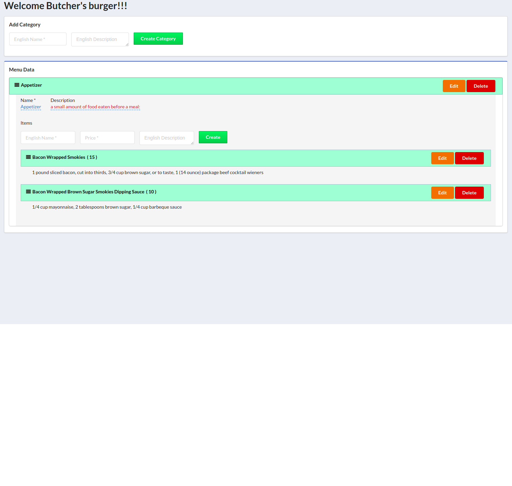

# Butcher's burger

React app based with SemanticUI

## Prerequisites
 - Node.js
 - MongoDB

## Installation

Install packages
```
cd butcher-burger
npm install
```

Create mongoDB and category collection
```
cd butcher-burger/api/database/migrations
node createDb.js
node createCategoryCollection.js
```

Start node API
```
cd butcher-burger/api
node server.js

Server is running at http://localhost:3000/
```

Start node FrontEnd
```
cd butcher-burger
node start

Project is running at http://localhost:8080/
```

## Login & Roles
 - Admin:
    - username: admin
    - password: admin
    - Role: 
        - Can View the menu.
        - Can add new Categories/Items.
        - Can Edit Categories or Item's names and their prices.
        - Can delete Categories/Items.
- User:
    - username: user
    - password: user
    - Role: 
        - Can View the menu

# Screenshots


